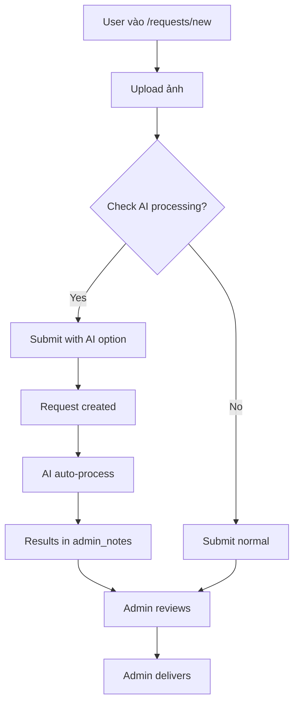
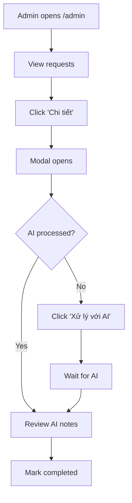

# 🚀 HƯỚNG DẪN SỬ DỤNG HỆ THỐNG MỚI

## 📖 Tài Liệu Quan Trọng

| File | Mục đích | Đọc khi nào |
|------|----------|-------------|
| **UPGRADE_SUMMARY.md** | Tóm tắt tất cả nâng cấp | ⭐ ĐỌC ĐẦU TIÊN |
| **QUICK_START_NEW_FEATURES.md** | Bắt đầu nhanh 5 phút | Muốn test ngay |
| **COMPREHENSIVE_UPGRADE_COMPLETE.md** | Chi tiết đầy đủ | Cần hiểu sâu |

---

## ⚡ Bắt Đầu Ngay (3 bước)

### Bước 1: Kiểm Tra Environment

```bash
# Mở .env.local và verify:
GEMINI_API_KEY=your-key-here ✅
CLOUDINARY_API_KEY=your-key-here ✅
CLOUDINARY_API_SECRET=your-secret-here ✅
```

### Bước 2: Chạy Server

```bash
npm run dev
```

### Bước 3: Test Tính Năng Mới

#### A. Test Upload (User):
```
1. Vào: http://localhost:3000/requests/new
2. Kéo thả 3 ảnh vào vùng upload
3. Xem preview hiển thị
4. Click nút upload
5. Thấy ✅ checkmarks khi xong
```

#### B. Test AI Processing (User):
```
1. Điền mô tả request
2. Check ✅ "Xử lý tự động với AI"
3. Check ✅ "Gửi cho Admin xem xét"
4. Submit
5. Thấy toast: "AI đã xử lý X/X ảnh"
```

#### C. Test Admin Panel:
```
1. Vào: http://localhost:3000/admin
2. Tab "Requests"
3. Click "Chi tiết" trên request
4. Xem modal với full info
5. Click "Xử lý với AI" (nếu cần)
6. Review admin notes
7. Mark as completed
```

---

## 🎯 Tính Năng Chính

### 1. EnhancedUpload Component
**Location:** `components/ui/EnhancedUpload.tsx`

```tsx
import EnhancedUpload from '@/components/ui/EnhancedUpload'

<EnhancedUpload
  maxFiles={5}
  maxSize={10}
  onUploadComplete={(urls) => console.log(urls)}
  required
/>
```

**Features:**
- Drag & drop
- Preview grid
- Progress tracking
- Error handling
- Retry failed

### 2. AI Auto-Processing API
**Endpoint:** `POST /api/admin/requests/{id}/process-ai`

```bash
curl -X POST http://localhost:3000/api/admin/requests/{id}/process-ai \
  -H "Content-Type: application/json" \
  -d '{"action":"restore","prompt":"Professional restore"}'
```

**Response:**
```json
{
  "success": true,
  "summary": {
    "total": 3,
    "successful": 3,
    "processing_time": "2.5s"
  }
}
```

### 3. RequestDetailModal
**Location:** `components/admin/RequestDetailModal.tsx`

```tsx
import RequestDetailModal from '@/components/admin/RequestDetailModal'

<RequestDetailModal
  isOpen={show}
  onClose={() => setShow(false)}
  request={selectedRequest}
  onUpdate={fetchRequests}
/>
```

**Hiển thị:**
- User info + avatar
- Original images (grid 3 cols)
- AI processing section
- Admin notes
- Status management

---

## 🔥 Workflows

### User Submit Request với AI



### Admin Process Request



---

## 🛠️ Development Tips

### Debug AI Processing

```typescript
// Check AI results
console.log(request.admin_notes)

// Expected format:
/*
AI Processing Results (restore):
- Processed: 3/3 images
- Processing Time: 2.5s

Image 1:
✅ Success
Analysis: Old faded photo...
Suggestions: Manual touch-up needed
*/
```

### Debug Upload

```typescript
// Check uploaded URLs
console.log(uploadedUrls)
// ["https://res.cloudinary.com/...", ...]

// Check upload state
<EnhancedUpload
  onUploadComplete={(urls) => {
    console.log('Upload complete:', urls)
    setUploadedUrls(urls)
  }}
/>
```

### Debug Modal

```typescript
// Check modal state
const [showDetailModal, setShowDetailModal] = useState(false)

// Open modal
const handleViewDetail = (request) => {
  console.log('Opening detail for:', request.id)
  setSelectedRequest(request)
  setShowDetailModal(true)
}
```

---

## 🐛 Troubleshooting

### Issue: Upload không hoạt động

**Solution:**
```bash
# Check .env.local
CLOUDINARY_API_KEY=...
CLOUDINARY_API_SECRET=...

# Restart server
npm run dev
```

### Issue: AI processing fails

**Solution:**
```bash
# Check Gemini API key
GEMINI_API_KEY=...

# Check quota
curl http://localhost:3000/api/process-images

# Check logs
# Server console sẽ hiển thị errors
```

### Issue: Modal không mở

**Solution:**
```tsx
// Check import
import RequestDetailModal from '@/components/admin/RequestDetailModal'

// Check state
const [showDetailModal, setShowDetailModal] = useState(false)
const [selectedRequest, setSelectedRequest] = useState<UserRequest | null>(null)

// Check onClick
onClick={() => handleViewDetail(request)}
```

### Issue: Ảnh upload nhưng không hiển thị

**Solution:**
```typescript
// Check onUploadComplete callback
<EnhancedUpload
  onUploadComplete={(urls) => {
    console.log('Uploaded:', urls) // Should log URLs
    setUploadedUrls(urls) // Update state
  }}
/>

// Check if URLs are stored
useEffect(() => {
  console.log('Current URLs:', uploadedUrls)
}, [uploadedUrls])
```

---

## 📊 Testing Checklist

### Manual Testing

**Upload:**
- [ ] Drag & drop 3 files → Preview shows
- [ ] Click upload → Progress shows
- [ ] Upload complete → Checkmarks appear
- [ ] Remove file → Preview removes
- [ ] File too large → Error toast
- [ ] Wrong file type → Error toast

**AI Processing (User):**
- [ ] Submit with AI option → Request created
- [ ] AI processes → Toast notification
- [ ] Results saved → Check /requests page

**Admin Panel:**
- [ ] View requests → List shows
- [ ] Click "Chi tiết" → Modal opens
- [ ] View user info → Displays correctly
- [ ] View images → Grid renders
- [ ] Trigger AI → Loading shows
- [ ] Review notes → AI results display
- [ ] Mark completed → Status updates

**End-to-End:**
- [ ] User submits → Request appears in admin
- [ ] AI processes → Notes updated
- [ ] Admin reviews → Can see all info
- [ ] Admin delivers → User receives
- [ ] Status tracking → Works throughout

---

## 🎨 Code Examples

### Custom Upload Handler

```typescript
const [uploadedUrls, setUploadedUrls] = useState<string[]>([])

<EnhancedUpload
  maxFiles={10}
  maxSize={20}
  onUploadComplete={(urls) => {
    setUploadedUrls(urls)
    toast.success(`Uploaded ${urls.length} images!`)
  }}
/>
```

### Custom AI Processing

```typescript
const handleCustomAI = async (requestId: string) => {
  const response = await fetch(
    `/api/admin/requests/${requestId}/process-ai`,
    {
      method: 'POST',
      headers: { 'Content-Type': 'application/json' },
      body: JSON.stringify({
        action: 'enhance',
        prompt: 'Custom prompt here'
      })
    }
  )

  const data = await response.json()
  console.log('AI Results:', data.results)
}
```

### Custom Modal Actions

```typescript
<RequestDetailModal
  request={selectedRequest}
  onUpdate={() => {
    // Custom refresh logic
    fetchRequests()
    toast.success('Request updated!')
  }}
/>
```

---

## 📚 API Reference

### POST /api/admin/requests/[id]/process-ai

**Request:**
```json
{
  "action": "restore" | "enhance" | "colorize" | "upscale" | "harmonize",
  "prompt": "Optional custom prompt"
}
```

**Response:**
```json
{
  "success": true,
  "request_id": "uuid",
  "results": [
    {
      "index": 0,
      "original": "url",
      "success": true,
      "analysis": "...",
      "suggestions": "..."
    }
  ],
  "summary": {
    "total": 3,
    "successful": 3,
    "failed": 0,
    "processing_time": "2.5s"
  },
  "admin_notes": "Full report..."
}
```

---

## ✅ Next Steps

1. **Test Everything:**
   - Upload flow
   - AI processing
   - Admin panel
   - End-to-end workflow

2. **Customize:**
   - Adjust max files/size if needed
   - Add custom AI prompts
   - Customize modal layout
   - Add more AI actions

3. **Deploy:**
   - Set production env vars
   - Test on staging first
   - Monitor AI success rate
   - Collect user feedback

4. **Monitor:**
   - AI processing time
   - Upload success rate
   - User engagement
   - Error rates

---

## 🎉 Done!

**Hệ thống đã sẵn sàng!**

Bắt đầu test ngay:
```bash
npm run dev
# → http://localhost:3000/requests/new
```

Gặp vấn đề? Đọc:
- COMPREHENSIVE_UPGRADE_COMPLETE.md (chi tiết)
- QUICK_START_NEW_FEATURES.md (nhanh)

**Happy coding!** 🚀
